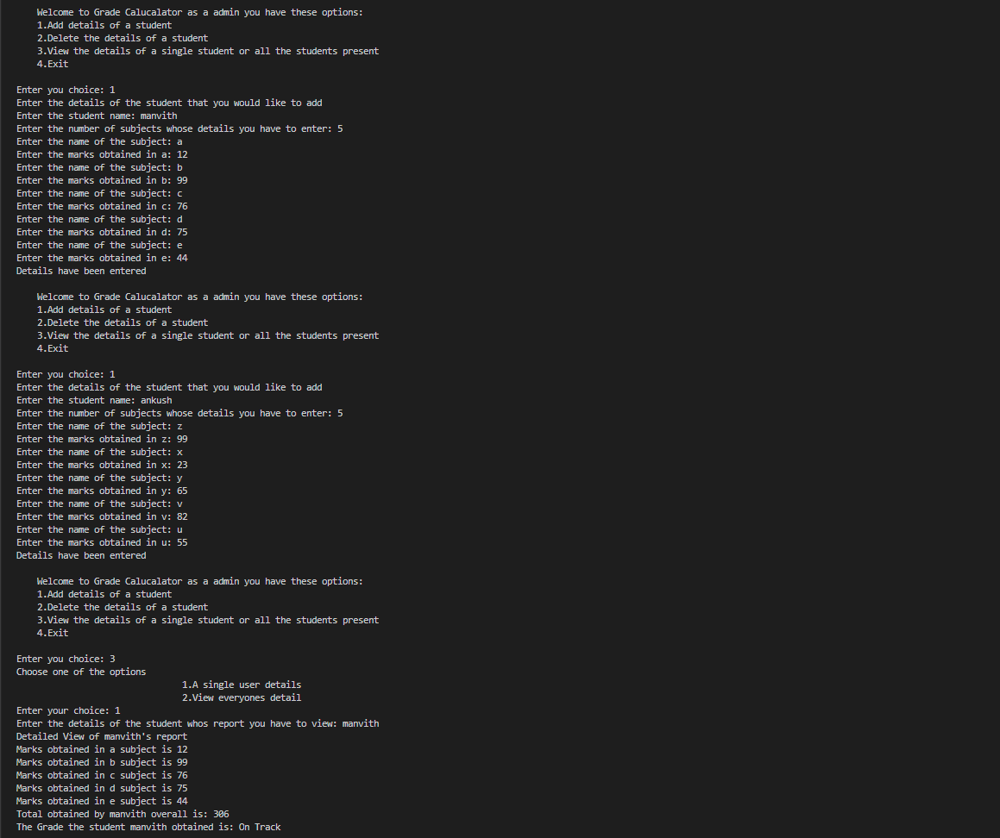
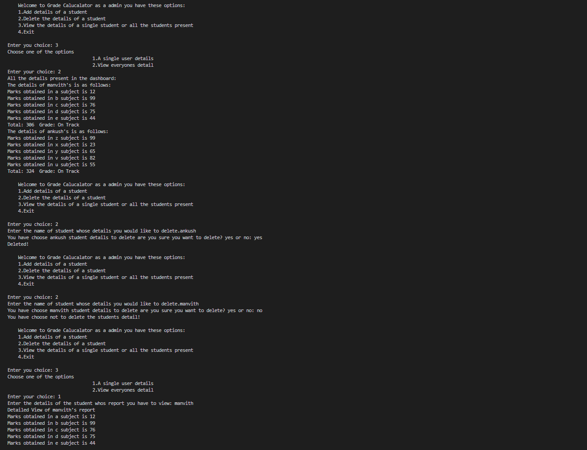
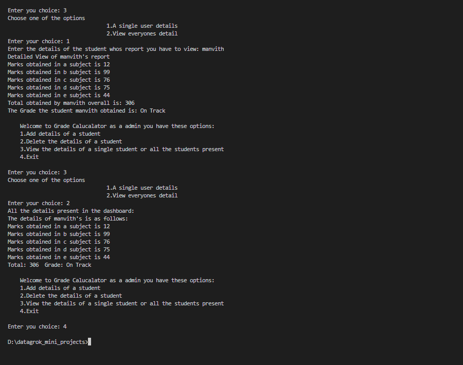

# Week 1 Mini Project — CLI Grade Calculator

**Track:** Python (Week 1 — Beginner)
**Program:** DataGrokr Pre-Learning Program (PLP)

## Description

A command-line grade calculator built for the DataGrokr PLP Week 1 mini project. Covers the core Week 1 Python fundamentals: **functions, loops, and dictionaries**, along with exception handling and control flow.

The program runs as an admin-style CLI menu that stays active until the user chooses to exit. It supports:

1. **Add details of a student** — enter a student's name and marks across multiple subjects.
2. **Delete the details of a student** — remove a student's record, with a yes/no confirmation step.
3. **View the details of a single student or all students** — view one student's full report (marks, total, grade) or view everyone in the dashboard at once.
4. **Exit** — ends the program.

## Design Notes

- Each student's subject marks are stored in a **fresh dictionary per student** (`{subject: marks}`), keyed by name inside a master `details` dictionary — avoids sharing one mutable dictionary across multiple students.
- Marks are converted to `int` at the point of input, so totals and averages can be calculated without type errors.
- **Grade is calculated on demand**, not stored — `total_calc()` and `grade_calc()` always compute fresh from the current marks, so there's no risk of a stored grade going out of sync with the underlying data.
- Wrapped in `try/except` blocks to handle invalid menu input, non-numeric marks entry, and lookups for students that don't exist.

## Grade Bands

| Average | Grade |
|---|---|
| >= 85 | Excellent |
| 75 - 84 | Strong Performance |
| 60 - 74 | On Track |
| < 60 | Revisit |

## How to Run

```bash
python week1.py
```

Follow the on-screen menu (1-4) to add, delete, or view student records.

## Sample Output

**Adding students and viewing an individual report:**



**Viewing all students, then deleting a student (with confirmation):**



**Re-viewing after delete, dashboard check, and exit:**



## Author

Manvith — DataGrokr PLP, Week 1